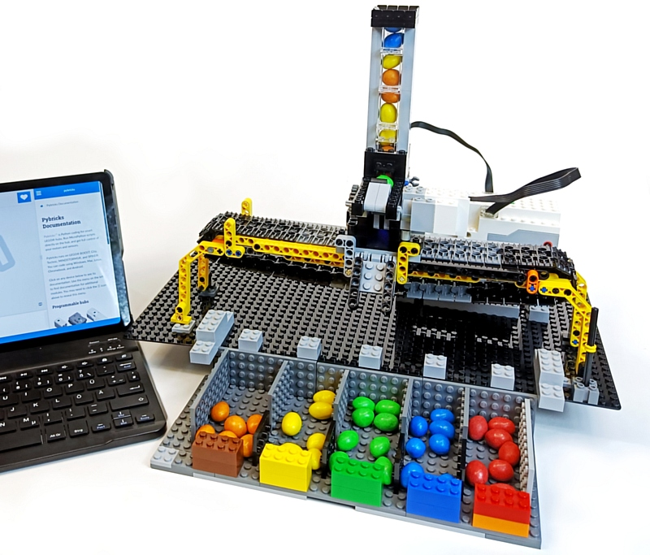

Maker Media GmbH

***

# Pybricks: Python steuert Lego-Roboter

**Pybricks bringt Python auf verschiedene Robotik-Bausteine von Lego. Im Gegensatz zur bisherigen Herstellerlösung entstehen so autonome Roboter, die nicht auf ein Tablet angewiesen sind. Die Programmierung erfolgt in einer modernen IDE im Browser über Bluetooth.**

 

Den vollständigen Artikel gibt es in der [Make 3/23 ab Seite 78]().
